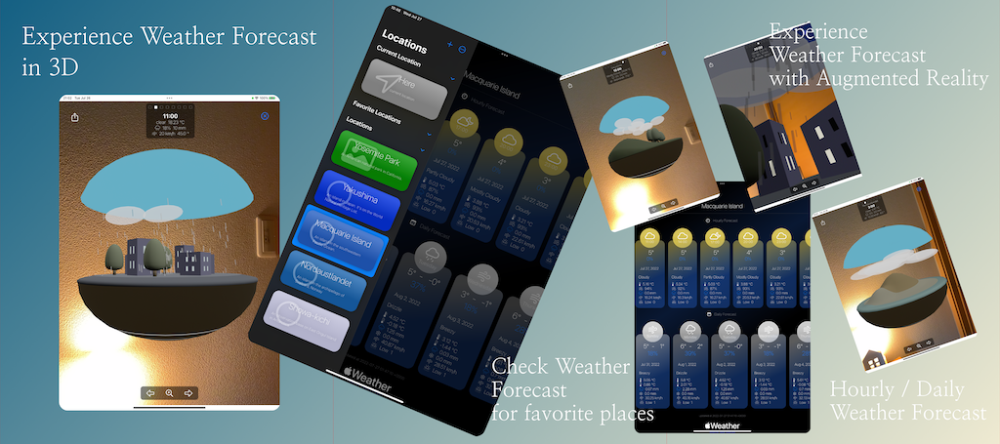
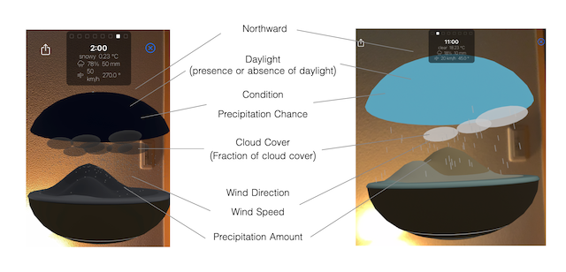

# iOS app: AR Weather Locations

This is an iOS app that displays the weather forecast for any locations in AR (Augmented Reality).

- It shows the weather forecast for the current location.
- It shows the weather forecast for the locations you registered over the world.
- It displays the weather forecast in 3D/AR.

 

## Requirements

- Xcode 14.1+
- iOS 16.0+ / iPadOS 16.1+
- `App ID` registered with `WeatherKit` App Service enabled ... Refer to the Apple Documentation about that. (https://developer.apple.com/documentation/weatherkit/fetching_weather_forecasts_with_weatherkit) 

## Builds

- Build 1: App Store Connect upload test
- Build 2: TestFlight Beta 1
- Build 3: TestFlight Beta 2
- Build 4: Ver.1.0 Released on App Store   ... iOS: Portrait only
- Build 5: Ver.1.1 developing

## Frameworks

- Core Location: The app uses the Significant-change Location Service. It's the most energy efficient location service.
- SwiftUI: NavigationSplitView
- ARKit / RealityKit
- WeatherKit: The weather forecast will be gotten from the Apple's Weather Services.

## Specific domains, identifiers

The `AppConstant.swift` defines specific domains and identifiers like `https://www.atarayosd.com/weather`, `https://apps.apple.com/app/id1636107272`, and `@weatherarapp`.
Please change them to your own.

## License

- MIT
